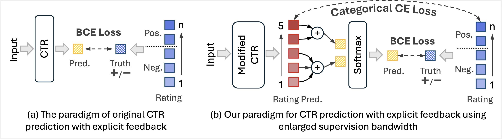

# Scaled Supervision is an Implicit Lipschitz Regularizer
 

Welcome to the official code repository for the **ICWSM 2025** paper "**Scaled Supervision is an Implicit Lipschitz Regularizer**". It adapts from the public code repository [RecBole](https://www.google.com/url?sa=t&rct=j&q=&esrc=s&source=web&cd=&cad=rja&uact=8&ved=2ahUKEwj_oLzE7ruIAxUwGFkFHan_GDIQFnoECAkQAQ&url=https%3A%2F%2Fgithub.com%2FRUCAIBox%2FRecBole&usg=AOvVaw3tePg3tzwZUWkgSKsBHBzh&opi=89978449). 

## Introduction
In modern social media, recommender systems (RecSys) rely on the click-through rate (CTR) as the standard metric to evaluate user engagement.
CTR prediction is traditionally framed as a *binary classification* task to predict whether a user will interact with a given item. However, this approach overlooks the complexity of real-world social modeling, where user, item, and their interactive features change dynamically in fast-paced online environments. This dynamic nature often leads to model instability, reflected in overfitting short-term fluctuations rather than higher-level interactive patterns.
In this work, we aim to alleviate the overfitting problem by **increasing the supervision bandwidth** in CTR training.
We *(i) theoretically*, we formulate the impact of fine-grained preferences on model stability as a Lipschitz constrain;
*(ii) empirically*, we discover that scaling the supervision bandwidth can act as an \textit{implicit} Lipschitz regularizer, stably optimizing existing CTR models to achieve better generalizability.

## How to Run
1. Install all the required packages found [here](https://github.com/RUCAIBox/RecBole/blob/master/requirements.txt).
2. Download all the benchmark datasets used in the paper, including ML-1M, Yelp2018, and Amazon-book. Make sure the folders are named `ml-1m`, `yelp2018`, and `amazon-book` respectively.
3. Run the command `python run_recbole.py --model=<model_name> --dataset=<dataset_name> [hyper_parameter_setting]` to train a new CTR model from scratch.
4. To apply our approach, add the hyperparameter settings `--multi_cls=5 --multi_ratio=<chosen_ratio>`. You may consult the commands in `commands.sh`.
5. To evaluate the ranking metrics, `python recbole_rank_eval.py --checkpoint=<saved_model_checkpoint>`.

### Acknowledgement
This repository adapts from the public code repository [RecBole](https://www.google.com/url?sa=t&rct=j&q=&esrc=s&source=web&cd=&cad=rja&uact=8&ved=2ahUKEwj_oLzE7ruIAxUwGFkFHan_GDIQFnoECAkQAQ&url=https%3A%2F%2Fgithub.com%2FRUCAIBox%2FRecBole&usg=AOvVaw3tePg3tzwZUWkgSKsBHBzh&opi=89978449).